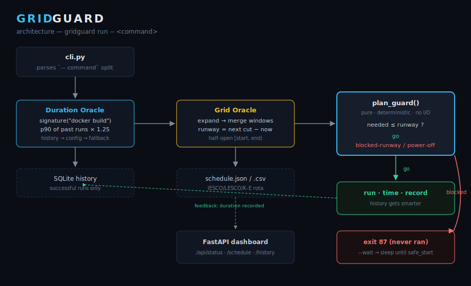

# GridGuard ⚡

**A grid-aware command guard for load-shedding environments. It refuses to start long commands that a power cut would kill mid-run — exiting with the reserved code `87` instead — and can wait for a safe window automatically.**

[](https://github.com/Mughirah-Nasir/gridguard/actions)
[](https://www.python.org/)
[](LICENSE)
[](tests/)

```text
$ gridguard run -- docker build -t app .
[gridguard] BLOCKED: only 41m of runway before the next cut at Fri 14:00,
but the command needs ~1h05m. Next safe start: Fri 16:00.
Re-run with --wait to start automatically.
$ echo $?
87
```

## The problem

In most of Pakistan (and much of South Asia and Africa), mains power follows a
published **load-shedding rota** — e.g. off daily 14:00–16:00, plus peak-hour
cuts. If you start a 25-minute Docker build at 13:45, the cut at 14:00 kills it
half-way: corrupted layer cache, a half-applied database migration, a Git push
that died mid-pack. UPS backup buys minutes, not build-lengths.

The schedule is *known in advance*, so the failure is avoidable. GridGuard
checks a schedule **you enter yourself** (JSON or CSV) before letting the
command start. It does not predict, fetch or scrape outage information --
there is no magic here, just arithmetic against your own rota.

## How it works

```text
gridguard run -- <command>
        │
        ▼
┌─────────────────┐   "how long will this take?"
│ Duration Oracle │── p90 of past runs (SQLite history)
└────────┬────────┘   → config default → fallback
         ▼  estimate × safety factor (1.25)
┌─────────────────┐   "is there enough runway?"
│   Grid Oracle   │── load-shedding schedule (JSON/CSV)
└────────┬────────┘   runway = time until next cut
         ▼
   ┌───── plan ─────┐
   │ go             │→ run it, time it, record to history
   │ blocked        │→ exit 87 (or sleep until safe with --wait)
   └────────────────┘
```

1. **Estimate.** GridGuard normalises your command to a signature
   (`docker build -t app .` → `docker build`) and looks up how long that kind
   of work has taken *on your machine*, using the **90th percentile** of past
   successful runs. No history yet? It falls back to per-command defaults from
   config, then a global fallback.
2. **Check the grid.** It expands your feeder's schedule (recurring weekday
   rules + one-off maintenance notices), merges overlapping windows, and
   computes the **runway** — time until the next cut.
3. **Decide.** If `estimate × safety_factor` fits the runway: run, time it,
   and record the result (so the next estimate is smarter). If not: exit `87`
   without running, printing when the next safe window opens — or, with
   `--wait`, sleep until then and start automatically.

## Quick start

```bash
pip install -e ".[dashboard]"

# point at a schedule (see examples/) and guard something heavy
gridguard run --schedule examples/iesco-f7.json -- docker build -t app .

# or wait for a safe window instead of failing
gridguard run --schedule examples/iesco-f7.json --wait -- alembic upgrade head

# what's the grid doing?
gridguard status --schedule examples/iesco-f7.json
gridguard schedule show --schedule examples/iesco-f7.json --hours 24

# convert the rota your aunty forwarded on WhatsApp (as CSV) into native JSON
gridguard schedule import rota.csv --zone IESCO-F7-1 -o schedule.json

# live control-room dashboard
gridguard serve --schedule examples/iesco-f7.json   # http://127.0.0.1:8087
```

Real output from `status` and `schedule show`:

```text
zone:    IESCO-F7-1
now:     Fri 2026-06-12 11:40 PKT
power:   ON
runway:  2h19m until next cut
next cut: Fri 14:00 (scheduled load-shedding)

upcoming cuts for IESCO-F7-1 (next 24h):
  Fri 06-12 14:00 -> 16:00  (2h00m)  scheduled load-shedding
  Fri 06-12 20:00 -> 22:00  (2h00m)  peak-hour shedding
  Sat 06-13 02:00 -> 04:00  (2h00m)  scheduled load-shedding
```

### Using exit code 87 in scripts

```bash
gridguard run -- ./deploy.sh
case $? in
  0)  echo "deployed" ;;
  87) echo "grid-blocked — deferred, not failed" ;;
  *)  echo "deploy itself failed" ;;
esac
```

Configuration lives in `gridguard.toml` (all optional):

```toml
zone = "IESCO-F7-1"
schedule = "schedule.json"
safety_factor = 1.25
percentile = 90
min_samples = 3
fallback_seconds = 120

[durations]               # starting estimates before history exists
"docker build" = 600
"alembic upgrade" = 90
```

## Architecture & trade-offs

These are the decisions I'd defend in an interview:

* **Exit code 87 as a sentinel.** A wrapper must let callers distinguish
  "GridGuard refused" from "your command failed". `87` is outside the ranges
  common tools use (1, 2, 125, 126–128, 128+signal), so a Makefile or CI step
  can branch on it safely.
* **p90, not mean or max, for duration estimates.** Command runtimes are
  right-skewed: mostly fast, occasionally slow (cold cache, big migration).
  The mean under-estimates and gets builds killed; the max is hostage to one
  freak run. p90 plans for "a slow-ish day". Failed runs are excluded — a
  build that crashed in 3s must not teach the oracle the build is fast.
* **Pure decision core.** `plan_guard(now, oracle, needed)` is a pure
  function: no clock reads, no subprocesses, fully deterministic. The
  executor around it takes injectable `now_fn`/`sleep_fn`/`runner`, so the
  test-suite simulates hours of waiting in microseconds and never launches a
  real process. This is why the whole suite (110 tests) runs in well under a second.
* **Half-open `[start, end)` windows.** A cut ending 16:00 means power is
  back *at* 16:00 exactly — no off-by-one at boundaries, verified by tests.
* **Windows are merged before runway math.** Two back-to-back cuts
  (12:00–14:00, 14:00–16:00) must not present a fake instant of power at
  14:00. Adjacent and overlapping windows coalesce first.
* **Saw-tooth insight in `next_safe_start`.** Runway only ever *jumps up*
  when a cut ends, then decays linearly. So the only candidate start times
  worth testing are "now" and each window's end — a handful of points, not a
  minute-by-minute scan.
* **Schedules model outages, not uptime** — because that's how IESCO/LESCO/
  K-Electric actually publish rotas, so authoring stays human-friendly.
* **SQLite + stdlib everywhere.** The core has *zero* third-party runtime
  dependencies (just `tzdata` on Windows for timezones). FastAPI/uvicorn are
  an optional `[dashboard]` extra. A guard tool should be lighter than the
  jobs it guards.

### Known limits (honest)

* **Schedules are entered manually.** GridGuard reads a JSON/CSV rota that
  you maintain. It does not predict outages, does not fetch schedules from
  IESCO/LESCO/K-Electric websites, and has no PDF importer. If your rota
  changes and you don't update the file, GridGuard is confidently wrong.

* GridGuard trusts the schedule; **unscheduled** outages still need a UPS and
  luck. (Pairing it with a voltage-sensing serial input is the obvious v2.)
* Estimates are per-signature, not per-arguments — `docker build` of a tiny
  image and a huge one share history. The `--estimate` override exists for
  exactly that.
* `--wait` polls a wall clock; if the machine sleeps/hibernates through the
  safe window it re-plans on wake, which may pick a later window.

## Dashboard

`gridguard serve` starts a small FastAPI app with a dark control-room UI:
live power lamp, runway countdown, a 24-hour outage timeline, and the recent
guarded-run log. JSON endpoints (`/api/status`, `/api/schedule`,
`/api/history`) are also there for your own scripts.

> **Local use only.** The dashboard has no authentication and shows your
> command history. It binds to `127.0.0.1` by default -- keep it that way,
> and never expose it on a public network. See [SECURITY.md](SECURITY.md).



## Security & privacy

GridGuard is a **local** tool. Two things to know before using it:

* The history database records the **full raw command line** of every
  guarded run (that's how duration estimates work). Don't put secrets in
  command lines, and treat the database file as private.
* The dashboard is unauthenticated and meant for `127.0.0.1` only.

Details and reporting instructions: [SECURITY.md](SECURITY.md).

## Development

```bash
pip install -e ".[dashboard,dev]"

python -m ruff check .      # lint
python -m pytest -v         # test suite
python -m build             # sdist + wheel
python -m benchmark.run_scenarios   # decision-core throughput on YOUR machine
```

Project layout: `src/gridguard/` (library + CLI), `tests/` (pytest),
`examples/` (sample schedules), `.github/workflows/ci.yml` (CI on 3.10/3.11/3.12).

## AI assistance disclosure

This project was designed and directed by me and built in pair-programming
sessions with Claude (Anthropic), which I use openly as a coding partner.
The problem choice, the exit-87 contract, the p90-with-safety-factor policy,
and the pure-core/injected-clock testing architecture are decisions I can
defend line-by-line; two real bugs (stale previous-day windows leaking from
`expand()`, and the signature normaliser mis-parsing `git -C /repo status`)
were caught by the test-suite during development and fixed — see the commit
history. See [AUTHENTICITY.md](AUTHENTICITY.md) and
[PROVENANCE.md](PROVENANCE.md) for how authorship is evidenced.

## License

[MIT](LICENSE) © 2026 Mughirah Nasir
